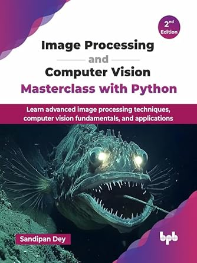

# Learning Image Processing and Computer Vision through problem solving with python

## Book Chapters
1.	Image Restoration and Inverse Problems in Image Processing
2.	More Image Restoration and Image Inpainting
3.	Image Segmentation
4.  More Image Segmentation
5.	Image Feature Extraction and its Applications: Image Registration
6.	More Applications of Image Feature Extraction
7.	Image Classification
8.	Object Detection and Recognition
9.	Applications of Image Processing and Computer Vision in Medical Imaging
10.	More Applications in Medical Imaging and Remote Sensing
11.	Miscellaneous Problems in Image Processing and Computer Vision

  
<h2>Animations from the Book

 
   
 

 
 
 

 
 
 
 

  
<h2>📚 Other Books by the Author

If you find this repository useful, you may also be interested in the author's previous books on image processing and computer vision:

- **Hands-On Image Processing and Computer Vision with Python, Second Edition** 
  https://github.com/PacktPublishing/Hands-On-Image-Processing-and-Computer-Vision-with-Python-Second-Edition

- **Image Processing Mastercalss with Python**
  GitHub: https://github.com/sandipan/Book-Image-Processing-Masterclass-with-Python
  
- **Hands-On Image Processing with Python**  
  GitHub: https://github.com/PacktPublishing/Hands-On-Image-Processing-with-Python

- **Python Image Processing Cookbook**  
  GitHub: https://github.com/PacktPublishing/Python-Image-Processing-Cookbook

These repositories contain complete source code, examples, datasets, and implementations accompanying the respective books. :contentReference[oaicite:0]{index=0}

